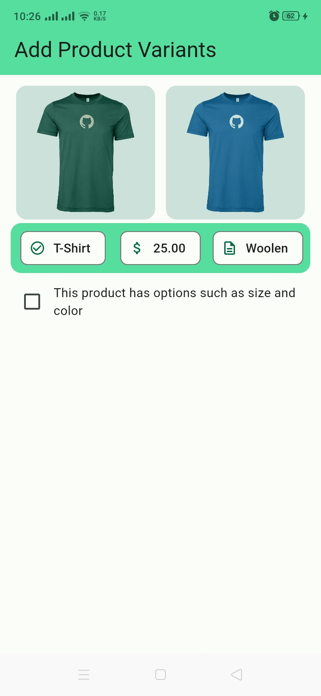
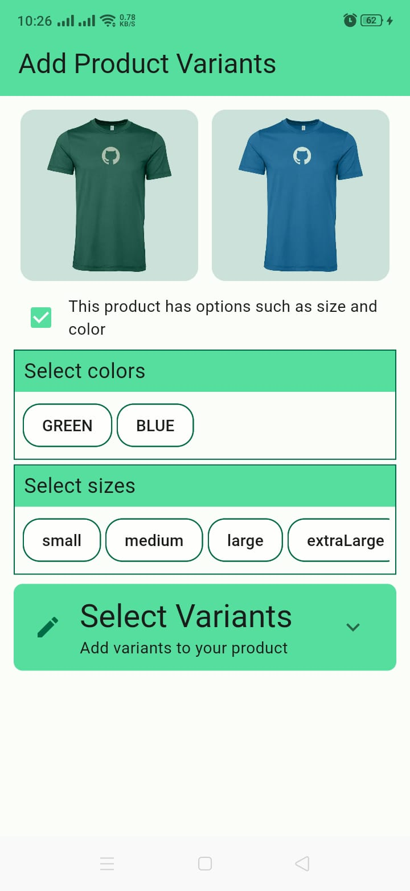
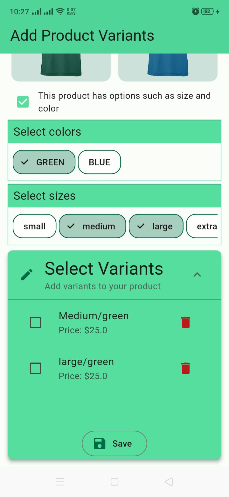
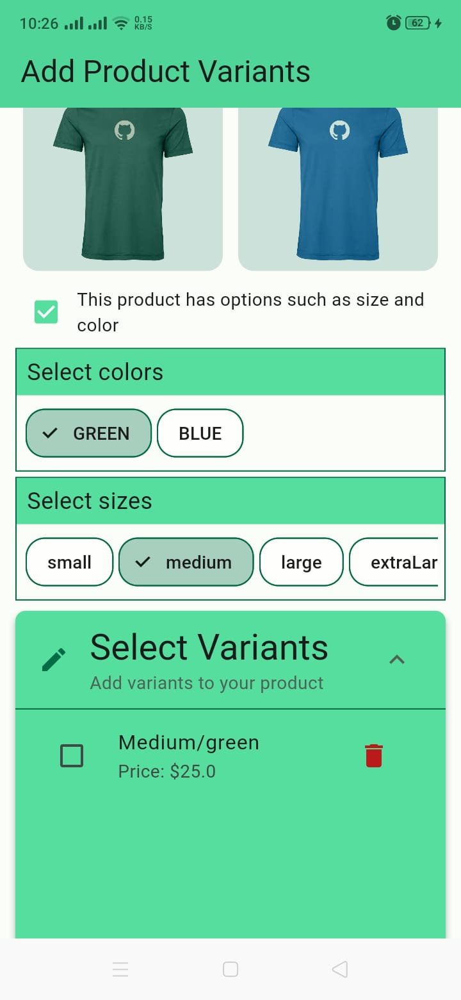
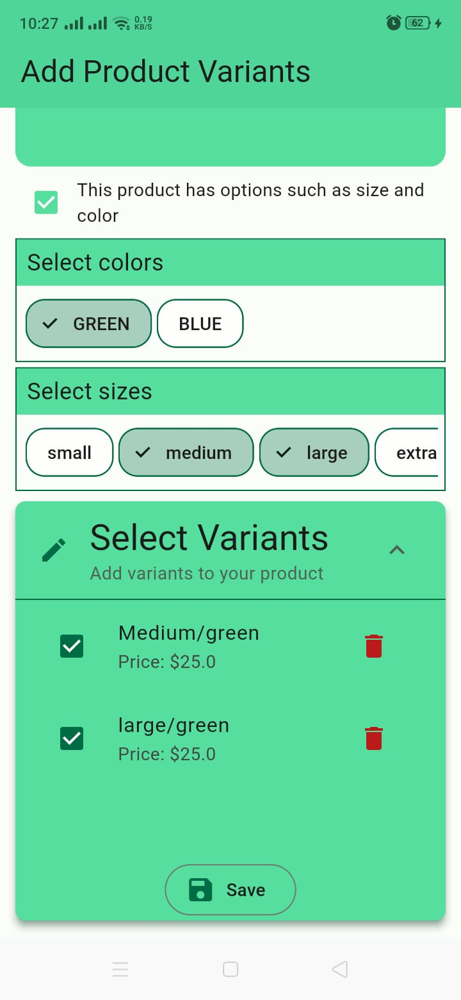
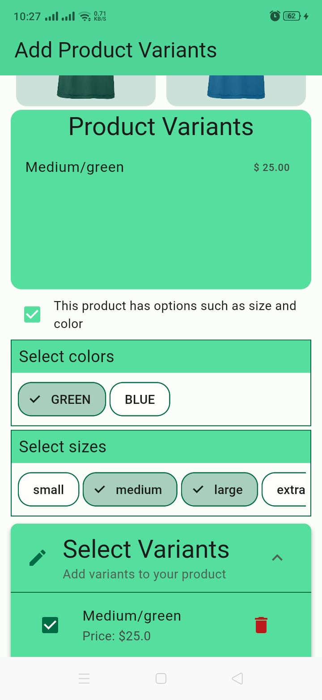
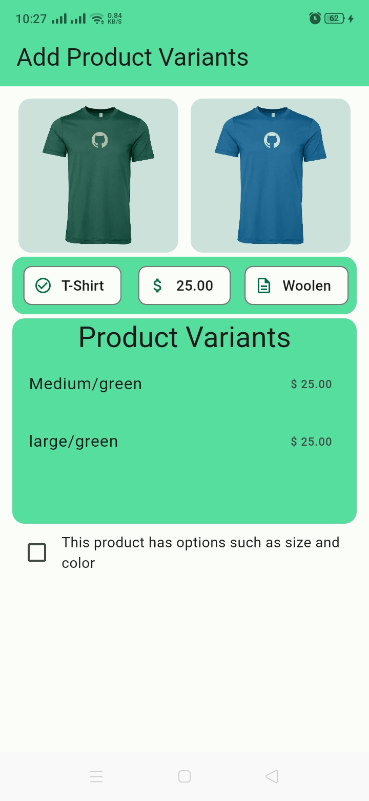

# Flutter Project

This is a Flutter project that generates product variant options and names.

## Project Structure

- `lib/`: This is where the main Dart code resides.
  - `constants/`: This directory contains all the constant values and methods used across the project.
  - `pages/`: This directory contains all the pages of the application.
  - `providers/`: This directory contains the state management logic using Riverpod.
  - `widgets/`: This directory contains all the custom widgets used across the project.
- `assets/`: This directory contains all the assets like images used in the project.

## Packages Used

- `flutter_riverpod`: This package is used for state management in the application.
- `expansion_tile_card`: This package give use the widget to create a card-like expansion tile.
- `multi_select_flutter` This package is used to create the multi-select chip fields in the application.

## Widgets

- `TileCard`: Provides an expansion tile card widget.
- `FormFields`: Provides the two multi-select chip fields.
- `GeneratedVariants`: Displays the generated variants and allows users to select the variants they want to save or delete the variants they don't want to save.
- `ImageContainer`: A simple widget to display the images of an already added product.
- `VariantCheckBoxText`: A toggle button that minimizes the widgets displayed on the AddProduct screen to allow the user to focus on the task at hand (selecting options, color, size) and then selecting the variants they want to save.
- `ProductInfo`: A widget that displays the product information (name, description, price).
- `UserVariantsCard`: This widget will display the variants that the user has selected and saved.
- `UserVariantCard`: This widget displays a list with the selected product variants.

## Logic

- The product variant options and names are generated using a combination of user selections upn selecting the color and size.
- The selected color and sizes are managed in two separate lists (`selectedColorsProvider` & `selectedSizesProvider`) and upon selection of either the color or size, an update the individual lists is done.
- If either lists are not empty, generate the product variants.
- Th combinations are managed using the `combinations` provider in the `providers/` directory.
- The combinations are managed in `Combination` class that maintains its internal state and the method used to generate the combinations is `generateCombinations`.
- Here's a step-by-step breakdown of what it does:

  - It takes two arguments: a list of colors and a list of sizes. These are presumably the options that a user has selected.
  - It uses the expand method on the list of colors. The expand method transforms each element in the list into zero or more elements by applying a function to it. In this case, the function is a map operation on the list of sizes.
  - The map operation takes each size and returns a string that represents a combination of a color and a size. The getSizeName and getColorName functions are used to get the names of the size and color respectively.
  - The result of the expand operation is a new list that contains all possible combinations of colors and sizes. This list is then assigned to the state.

- When a user selects or deselects an option, the `combinations` state is updated, which in turn updates the `GeneratedVariants` widget.
-
- The selected options are managed using the `userSelectedCombinations` provider in the `providers/` directory. When a user selects or deselects an option, the `userSelectedCombinations` state is updated, which in turn updates the `UserVariantCard` widget and the `GeneratedVariants` widget.

## Running the Project

To run the project, use the following command:

```sh
flutter pub get
flutter run
```

## APK

find the apk in the root directory of the project. `app-release.apk`

## Screenshots

Here are some screenshots of the app:

<table>
  <tr>
    <td></td>
    <td></td>
    <td></td>
    <td></td>
  </tr>
  <tr>
    <td></td>
    <td></td>
     <td></td>
  </tr>
</table>
